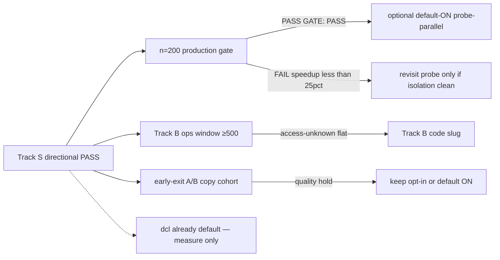

# Research Report: Next scan optimizations after Track S

**Timestamp:** 2026-08-27  
**Scope:** CLI/Desktop scan throughput after `--probe-parallel` directional PASS. Not a production 10k claim.  
**Non-goals:** new probe algorithm; CF bypass / stealth; concurrency >3; stop-on-hit; extension parity; default-ON quality flags.

## Executive Summary

Track S closed the **ok-site path-probe sequential** bottleneck as a **flagged** change. A/B n=61: **37.6% wall-clock** (1098s → 685s), **0 true→false**, ethics PASS. That is **`GATE: PASS (directional-throughput)` only**. Golden FP=0 **FAIL** (non-blocking). Cohort is **61 not 200**. `out/design-pilot-200/companies.json` is **gone** — production gate is blocked on recover, not on more probe code.

Four items the eval asked to rank:

| Rank | Item | Verdict | Why now |
|------|------|---------|---------|
| **1** | **n=200 cohort** | **DO NEXT** (ops) | Only path from directional → `GATE: PASS` production. Speedup may shrink on a 10k-like mix. |
| **2** | **Track B access** | **NEXT CODE SLUG** after ops window | Real jobs still burn ~31% wall on blocked/timeout. Probe-parallel does not help non-ok. Golden misses are mostly CF. |
| **3** | **`--early-exit`** | **MEASURE then maybe default** | Code exists, default OFF. Skips probe on strong homepage only. On n=61: **7/53 ok** would skip (~13% of ok, ~11% of cohort). Path-only still probed (3 ok). |
| **4** | **`domcontentloaded` default** | **SHIPPED — do not re-plan** | `cli/scan.ts` already `waitUntil: 'domcontentloaded'`. Isolation A/B never run. Optional diagnostic only. |

Do **not** invent a new probe algorithm. Do **not** flip `--probe-parallel` default ON until n=200 production gate. Do **not** abort images/fonts without a Track A recall A/B — `cli/browser.ts` documents asset abort OFF for extension parity; `--network-evidence` also observes those requests.

## Research Methodology

- Sources consulted: 18 internal + 5 external
- Date range: 2024-07 (Checkly goto) → 2026-08-27 (Track S A/B)
- Key search terms: Playwright `waitUntil` commit/dcl/load; resource blocking; browser restart memory; fail-fast timeouts; Track S metrics
- Internal: `research-260826-scan-performance-optimization.md`, `metrics-track-s-ab.md`, `research-260827-track-s-probe-algorithm.md`, `brainstorm-260827-track-s-status.md`, `ops-260813-track-b-access-runbook.md`, `brainstorm-260826-0909-project-status-next-scope.md`, `live-verify-260810-design-pilot-200.md`, `docs/07-test-plan.md`, `cli/scan.ts`, `lib/path-probe.ts`, `lib/early-exit.ts`, `cli/browser.ts`, `scripts/finalize-track-s-ab.mjs`, `scripts/build-track-s-cohort.mjs`, A/B JSONL
- External: Playwright Page.goto docs; Checkly goto/`waitUntil`; ScrapingBee Playwright speed (Jan 2026); BrowserStack timeouts; Playwright GitHub memory-leak issues

## Brainstorm contract (this report)

| Field | Content |
|-------|---------|
| **Outcome** | Ranked next optimizations with GO/NO-GO gates after Track S directional PASS. |
| **Constraints** | Ethics: `blocked≠none`, concurrency≤3, probe-batch≤3, no CF bypass, 28 paths + junk, no stop-on-hit. |
| **Non-goals** | New probe algo; default-ON probe-parallel before n=200; resource abort without A/B; extension throughput. |
| **Acceptance** | Rank table + per-item gate; shipped vs unmeasured; explicit rejects. |

---

## 1. What Track S already spent

### Shipped

| Piece | Evidence |
|-------|----------|
| `--profile-timing` JSONL | `cli/profile-timing.ts`; README |
| `--probe-parallel` batch≤3, junk-first, no stop-on-hit | `lib/path-probe.ts` |
| `goto` **dcl** (hang fix, not isolated A/B) | `cli/scan.ts:136` |
| Profile isolation: `newPage()` per company, always `closeQuietly` | `cli/browser.ts`, `cli/scan.ts` finally |
| Desktop checkbox default **OFF** | Phase 5 review PASS |
| Directional A/B | `metrics-track-s-ab.md` |

### A/B n=61 (paired) — measured

| Arm | Wall | ok | blocked | timeout | unknown | early-exit-eligible (ok+strong/platform) | path-only ok |
|-----|------|----|---------|---------|---------|------------------------------------------|--------------|
| Control | 1098s | 53 | 6 | 2 | 8 (13%) | 7 | 3 |
| Treatment (`--probe-parallel`) | 685s | 51 | 8 | 2 | 10 (16%) | 6 | 3 |

- Speedup **37.6%** (≥25% bar). Throughput checks PASS. Golden **FAIL** (vecteezy / madeindesign / finnishdesignshop **blocked**; mohd.it none→partner_trade = Track A, not probe).
- **Cohort bias:** 40/61 control = `none` (65%). Pilot-200 was 88/200 none (44%) + 56/200 unknown (28%). n=61 is easier than 10k.
- Phase timings **OFF** on gate run — cannot split goto vs probe vs settle on this pair.
- Treatment interrupt gap (control finished 2026-08-26 19:47Z; treatment 2026-08-27 02:04Z) — directional only.

### Explicitly closed (do not reopen)

| Idea | Why closed |
|------|------------|
| New probe algorithm / adaptive batch / stop-on-hit | `research-260827-track-s-probe-algorithm.md`: keep batch-3. Stop-on-hit **rejected** (FN on path-only). |
| `waitUntil: 'commit'` | Detector needs parsed DOM (`runDetector` queries `a`). Checkly: commit is fastest for *tests with auto-wait*; here inject runs immediately after settle. **dcl is the floor.** |
| Concurrency >3 / stealth / CF bypass | Ethics. Industry bypass blogs exist; **out of scope**. HITL + `--scan-profile` remains the access path. |



---

## 2. Ranked backlog with gates

Scoring: **leverage on companies/h of useful CSV** × **evidence quality** × **ethics risk** (lower risk ranks higher). Useful CSV = true/false, not unknown.

### Rank 1 — Recover n=200 cohort (ops, not code)

**Status:** blocked on missing `out/design-pilot-200/companies.json`. Manifest is n=61 `directional: true`.

**Why first:** `finalize-track-s-ab.mjs` makes golden **blocking** only when `n≥200`. Until then no production throughput claim, no default-ON `--probe-parallel`. 37.6% is **not** transferable to 10k until the mix includes more blocked/slow CDN/ok-heavy sites.

**Fails first when:** recover yields <200 unique Company rows; or n=200 speedup <25% because n=61 was none-heavy (probe already cheap).

| Gate | Pass | Fail → |
|------|------|--------|
| **G1 Recover** | `node scripts/build-track-s-cohort.mjs` prints `n: 200`, `directional: false`. Source = real `companies.json` (pilot-200 or equivalent Trustpilot snapshot), **not** padded golden stubs. | Stop. Do not invent 139 fake domains. |
| **G2 Isolation** | Both arms: `--scan-profile --accept-failures --concurrency 2`; **only** `--probe-parallel` differs; `--profile-timing` **both on or both off**. Deny `*design-full-10k*`. | Invalid A/B. |
| **G3 Throughput** | Treatment wall ≥25% faster; both 200/200 complete. | If <25% **and** isolation clean → then (only then) revisit probe. Else fix isolation. |
| **G4 Quality (production)** | Golden FP=0 on overlapping domains (`docs/07` §5: 4/4 affiliate-high); none@ok FN=0; blocked→none=0; true→false=0; cross-domain=0. | `GATE: FAIL`. Do not default-ON. Golden blocked (vecteezy…) is **Track B**, not a probe revert — document exception vs fail. |
| **G5 Label** | Metrics file ends `GATE: PASS` **without** `(directional-throughput)` and **without** DIRECTIONAL banner. | Stay directional. |

**Next action:** locate/restore `out/design-pilot-200/companies.json` (or re-collect `limit=200` once). Rebuild manifest. Re-run `scripts/track-s-ab.sh`. Optional: same pair with `--profile-timing` **after** wall-clock gate (separate outs).

**Cheap add-on on same run:** `--profile-timing` diagnostic pair **after** G3 (not mixed into G3). Answers “is probe still #1?”

---

### Rank 2 — Track B access (blocked / timeout)

**Status:** runbook only (`ops-260813-track-b-access-runbook.md`). Code slug **not started** (project-status D1).

**Why second:** 10k-scale freeze n=3659: **unknown 31.3%** (blocked 51% of unknown, timeout 46%). Pilot-200: ok 72%, blocked 14.5%, timeout 12.5%. n=61 A/B still 13–16% unknown. Probe-parallel **skips** when `loadStatus !== 'ok'` (`cli/scan.ts` probe branch). Golden live misses on Track S = **blocked**, not detector.

**Already done (do not re-implement):**

- Probe skipped on non-ok
- `--scan-profile` + HITL CF
- `--accept-failures` (terminal timeout/error on resume)
- `closeQuietly` 3s; company wall 120s; goto 20s; retries ≤2

**Remaining levers (code, new slug):**

| Lever | Expected | Risk |
|-------|----------|------|
| Adaptive goto: ~12s fast-fail / ~25s slow class | Cut timeout tail vs 20s+retry×2 | False timeout on slow-but-real |
| Fail-fast after blocked detect — already skip probe; maybe skip retry on **blocked** (retry today is timeout/error only — OK) | — | — |
| Browser restart every N pages (profile mode, 10k) | Stall from memory (Playwright issues #6319, #17736, #29163) | Brief downtime; keepAlive must stay |
| Ops: profile warm + accept-failures on overnight | Job **finito**; unknown stays unknown | Operator choice |

**Industry:** fail-fast per-action timeouts, not one 120s blanket (BrowserStack/Checkly). Adaptive retry on **timeout** with backoff is standard; **do not** add stealth/proxy/CAPTCHA solve.

**Fails first when:** CF arms race. Timeout tuning cannot convert blocked → ok. That is HITL, not code.

| Gate | Pass | Fail → |
|------|------|--------|
| **B0 Ops first** | Runbook window ≥500 **new** rows; unknown-growth/h ↓ or documented flat; shard `age_s` typically <300 if shards used. | No code slug yet. |
| **B1 Access %** | Access-unknown (blocked+timeout+error)/n **≤20%** on that window **without** raising concurrency. Stretch from project-status Wave 4. | If flat after ops → open **new** plan (timeout/goto). |
| **B2 Ethics** | blocked→none = 0 always. No `page.route` stealth. No concurrency >3. | Hard stop. |
| **B3 Golden blocked** | vecteezy / madeindesign / finnishdesignshop: either ok after profile warm, **or** documented as CF (not ranking FAIL for throughput). flinders.nl stays unknown/blocked (golden). | Do not “fix” by classifying blocked as none. |

**Next action:** re-check `out/design-full-10k` if still live. Then B0 window. Code slug only if B0 proves process health and access-unknown still flat.

---

### Rank 3 — `--early-exit` (exists, default OFF)

**Status:** shipped (`lib/early-exit.ts`, CLI+Desktop unchecked). **Unmeasured** on a bounded A/B.

**Semantics:** skip path-probe only when `loadStatus===ok` **and** (strong link **or** platformHits **or** networkHits if `--network-evidence`). Path-only programs **still probe**. Matches classify row 2.

**Why third:** next **code** throughput lever on **ok+signal** sites after parallel probe. Does **zero** for the 40/61 none and for blocked. On control JSONL: **7 skip**, **3 path-only** (behance-like must keep probe). Upper bound this cohort ≈ skip probe on ~11% of companies. On 10k, skip rate = fraction of ok+strong homepage — unknown; measure.

**Do not combine** with `--probe-parallel` default-ON in the same A/B (confound). Isolate `--early-exit` only.

**Fails first when:** homepage empty + program only on a path not already in DOM/platform — those must still probe (already true). Weak-only (`partner_trade`) still probes (mohd.it, ozdesign) — correct.

| Gate | Pass | Fail → |
|------|------|--------|
| **E1 Isolate** | Copy cohort ≤80 or Track S 200; control vs `--early-exit` only; same concurrency/profile. Deny 10k. | Invalid. |
| **E2 Quality** | none@ok FN=0; golden 4/4 affiliate-high **when load ok**; path-only still has pathHits (spot-check ≥1 known path-only). blocked→none=0. | Keep default OFF forever. |
| **E3 Throughput** | Report probe-skip count + wall Δ. **No** hard % bar (original ≥3× was stretch, not gate). | Still useful as opt-in if E2 holds. |
| **E4 Default-ON** | Only if E2 PASS **and** skip rate ≥15% of ok on n≥80 **and** stakeholder accepts miss-path-only=0 (already guaranteed by helper). | Remain opt-in. Document as “fast daily / thorough overnight”. |

**Next action:** after Rank 1 or in parallel on a **copy** of track-a none-ok + golden, not on 10k.

---

### Rank 4 — `domcontentloaded` default (already the default)

**Status:** **SHIPPED.** `cli/scan.ts` `waitUntil: 'domcontentloaded'`, `tabTimeoutMs=20000`. Collect already dcl @ 45s. Original 2026-08-26 research still described `load` — **stale**.

**Why last among the four:** no remaining implementation. Shipped as xvfb `load` hang fix, **not** as isolated throughput A/B. Checkly (2024): `load` waits all assets; dcl is the scrape sweet spot; `commit` is faster but pre-DOM. ScrapingBee (2026-01): same — dcl + wait for the data you need.

**Do not** add `--fast-nav`. It would be a flag for a behavior that is already default.

| Gate | Pass | Fail → |
|------|------|--------|
| **D1 Code** | `cli/scan.ts` stays dcl. No silent revert to `load`. | Treat revert as regression. |
| **D2 Optional measure** | If someone needs “how many ms did dcl save”: n=50 pair load vs dcl, `--profile-timing`, golden none@ok. **Not** a ship gate. | Skip. |
| **D3 SPA miss** | If dcl+settle 1200ms drops homepage links: use existing `--lazy-settle` (default OFF, Track A). Do not switch global waitUntil to `load`. | Keep dcl. |

**Next action:** none for product. Optional D2 only if Rank 1 timings show **goto** still dominates (unlikely vs probe/access).

---

### Rank 5+ — later / reject

| Rank | Item | Disposition | Gate if ever |
|------|------|-------------|--------------|
| 5 | Default-ON `--probe-parallel` | After Rank 1 **`GATE: PASS`** (production) | Same G3–G5. Desktop checkbox may stay opt-in even if CLI default flips — product call. |
| 6 | Isolation regression test (`openPage` ≠ keepAlive) | Quality, not throughput. Phase 5 nit. | Unit: two `openPage()` → distinct Page; `scan.ts` has no profile skip-close. |
| 7 | Adaptive goto budget | Track B **code** after B0 | B1 + B2. Flag default OFF. |
| 8 | Browser restart every 200–500 pages | Hướng C; only if 10k profile RSS climbs | Memory series + no keepAlive death. |
| 9 | Probe **tier** (8 strong paths, then 28) | Defer. Changes path set vs Track S A/B baseline. | Only if Rank 1 speedup <25% **and** timings show probe still #1. FN gate on labeled path-only. |
| 10 | Resource abort (image/font/css) | **Defer / high risk** | Track A recall A/B; `--network-evidence` still works; blocked rate not ↑. Comment in `newScanContext`: abort OFF for parity. ScrapingBee win is real; **conflicts** with observation-set + possible CF fingerprint. |
| 11 | Worker pool of N contexts (ephemeral) | Cheap to abandon if context overhead <10% (original). Profile mode already shares context. | Profile-timing: openPage+close vs probe. |
| 12 | `waitUntil: 'commit'` | **Reject** | Detector needs DOM. |
| 13 | Stop-on-first-strong-hit | **Reject** | Plan red-team. |
| 14 | Extension probe-parallel / early-exit | Non-goal | — |
| 15 | mohd.it none→partner_trade | Track A detector, not speed | Soft-case / golden update — separate. |
| 16 | `npm run compile` 35 errors | CI debt | Not a throughput gate. |

---

## 3. Technology overview (pipeline post-Track S)

```text
openPage (profile: shared context, new page)
  → goto dcl 20s
  → settle 1200ms (or --lazy-settle MO ≤1200)
  → runDetector
  → if ok and not (--early-exit && strong/platform):
        junk fetch → 28 paths sequential OR batches of ≤3
        budget min(28*8s+8s, 90s, remaining 120s wall)
  → classify  → closeQuietly ≤3s
  → retry ≤2 if timeout/error only
```

**Worst-case ok, no early-exit:** goto 20 + settle 1.2 + probe 90 ≈ 111s (+ retry). Parallel does not raise the 90s cap; it **finishes more paths inside the cap** and cuts median when fetches are slow.

**Ethics unchanged:** junk-first soft-404; hit iff status ≠ junk and ∈ {200,301,302}; same-origin inject; batch max 3.

---

## 4. Current state vs 2026-08-26 research

| 2026-08-26 recommendation | 2026-08-27 state |
|---------------------------|------------------|
| `--profile-timing` | Done |
| Parallel path-probe batch 5… then capped 3 | Done, batch≤3 |
| `--fast-nav` dcl flag | **Default dcl**, no flag |
| Probe tier 8 then 28 | Not done — defer |
| `--early-exit` default | Still OFF — Rank 3 |
| Adaptive goto 12/25s | Not done — Rank 2/7 |
| Skip probe on blocked | **Done** (ok-only probe) |
| `--accept-failures` | Done, opt-in |
| `--scan-profile` | Done; desktop always on |
| Resource blocking | Still OFF — Rank 10 |
| Worker pool / browser restart | Not done — Rank 8/11 |
| n=200 A/B | Directional n=61 only — Rank 1 |

Pilot-200 (~4h / 200 @ conc 2 ≈ 50/h) vs n=61 treatment 685s ≈ **320/h** — **do not** advertise 320/h. Mix is not comparable.

---

## 5. Best practices (external) vs this product

| Practice | Apply? |
|----------|--------|
| `waitUntil: 'domcontentloaded'` for extract | **Yes — already** |
| `commit` for speed | **No** — need DOM before `evaluateInjectable` |
| Abort image/font/media | **Not yet** — parity + network-evidence + CF risk. A/B only. |
| No blind `waitForTimeout` | Lazy-settle already MO; default still 1200ms sleep — acceptable until timings say settle is #1 |
| Fail-fast per action | Partial (8s fetch, 3s close, 120s wall). Adaptive goto = Track B |
| Restart browser on long jobs | Track B/C if 10k RSS grows |
| Stealth / CF bypass | **Never** |
| Headless for speed | Product uses **headed + profile** for CF. Throughput second to access. |

---

## 6. Implementation recommendations

### Sequence (do in order)

1. **Rank 1** — recover 200 + production A/B. No product code.
2. **Rank 6 nit** — isolation unit test (cheap, prevents desktop silent-share regression). Can parallel with 1.
3. **Rank 3** — early-exit A/B on copy cohort. Keep default OFF unless E4.
4. **Rank 2 B0** — ops window. Code slug only if access-unknown flat.
5. **Rank 5** — default-ON probe-parallel **iff** Rank 1 `GATE: PASS`.
6. Defer 7–11. Reject 12–14.

### Quick start (Rank 1)

```bash
# recover companies.json into out/design-pilot-200/ then:
node scripts/build-track-s-cohort.mjs   # must print n:200 directional:false
bash scripts/track-s-ab.sh              # deny 10k; isolate --probe-parallel
# expect plans/reports/metrics-track-s-ab.md → GATE: PASS
```

### Common pitfalls

| Pitfall | Why it lies |
|---------|-------------|
| Treat 37.6% as 10k throughput | n=61 none-heavy; treatment had interrupt gap |
| Turn unknown% into Track S KPI | unknown = access. Track A/S must not claim unknown↓ |
| Bundle early-exit + probe-parallel + dcl in one A/B | Cannot attribute |
| Default-ON probe-parallel on directional PASS | Golden still FAIL; n<200 |
| Abort assets to “make dcl even faster” | dcl already ignores load assets; abort changes fingerprint + network-evidence |
| Retry blocked as if timeout | Wastes wall; blocked already skip probe |
| Pad cohort to 200 with random domains | Invalid production gate |

---

## 7. Security / ethics

- Concurrency ≤3, delay ≥1s recommended — unchanged.
- No CAPTCHA bypass, no stealth plugins, no `page.route` for evasion.
- `blocked ≠ none` is a hard gate on every experiment.
- Chrome profile = cookie jar for HITL CF; not a secret store in CSV. Track B must not log challenge tokens.
- Resource abort / extra headers / UA spoofing = ethics review if ever proposed.

---

## Resources & references

### Internal

- `plans/reports/research-260826-scan-performance-optimization.md`
- `plans/reports/metrics-track-s-ab.md`
- `plans/reports/research-260827-track-s-probe-algorithm.md`
- `plans/reports/brainstorm-260827-track-s-status.md`
- `plans/reports/ops-260813-track-b-access-runbook.md`
- `plans/260826-1909-cli-throughput-track-s/`
- `docs/07-test-plan.md` §5
- `scripts/finalize-track-s-ab.mjs`, `scripts/build-track-s-cohort.mjs`

### External

- [Playwright `page.goto`](https://playwright.dev/docs/api/class-page#page-goto)
- [Checkly — why `page.goto()` is slow (`waitUntil`)](https://www.checklyhq.com/blog/why-page-goto-is-slowing-down-your-playwright-test/)
- [ScrapingBee — Playwright scraping speed (2026-01)](https://www.scrapingbee.com/blog/playwright-web-scraping/)
- [Playwright network / route](https://playwright.dev/docs/network)
- Playwright memory: issues [#6319](https://github.com/microsoft/playwright/issues/6319), [#17736](https://github.com/microsoft/playwright/issues/17736)

---

## Appendices

### A. Glossary

| Term | Meaning |
|------|---------|
| Track S | Throughput on ethics cap; probe-parallel |
| Track A | Recall on `ok` pages; network-evidence / lazy-settle / early-exit quality |
| Track B | Access: blocked / timeout / error |
| Directional | n<200; golden non-blocking; not a production claim |
| Path-only | Affiliate evidence only from path-probe, not homepage |

### B. Gate cheat-sheet

| ID | GO | NO-GO |
|----|----|-------|
| G1–G5 | n=200 `GATE: PASS` | Stay directional; no default-ON parallel |
| B0–B3 | Ops then maybe timeout code | No stealth; no concurrency bump |
| E1–E4 | early-exit stays opt-in unless skip≥15% ok + quality | Quality fail → never default |
| D1–D3 | Keep dcl | Do not reintroduce `load` |

### C. Raw notes

- Control JSONL n=61: ok 53 / blocked 6 / timeout 2; early-exit skip 7; path-only 3.
- Treatment: ok 51 / blocked 8 / timeout 2; 99designs flipped ok-affiliate → blocked (access variance).
- `PROBE_PATHS` still 28. Batch 3 → ~10 rounds × 8s worst ≈ 80s vs 90s cap.
- Micro trial timings were **zeros** (flag off / 3-domain noise) — ignore `metrics-track-s-trial.md` for ranking.

---

## Unresolved questions

1. Can `out/design-pilot-200/companies.json` be restored from backup, or must collect re-run?
2. Stakeholder: directional PASS enough to ship desktop checkbox (already wired OFF) vs wait for n=200 before any marketing speed claim?
3. If n=200 speedup <25% with clean isolation: accept smaller win, or open probe-tier (Rank 9)?
4. Overnight 10k: is “job finishes with unknown” (`--accept-failures`) acceptable vs requeue forever?
5. Desktop: keep `--probe-parallel` unchecked even if CLI later defaults ON?

---

## Next steps

1. Rank 1 recover + production A/B (`GATE: PASS` unlabeled).
2. Isolation unit test (Rank 6) in the same week — not a plan slug.
3. Rank 3 early-exit A/B on copy cohort.
4. Rank 2 B0 ops window; Track B code slug **only** if access-unknown stays high.
5. No new Track S algorithm work unless G3 fails clean.
