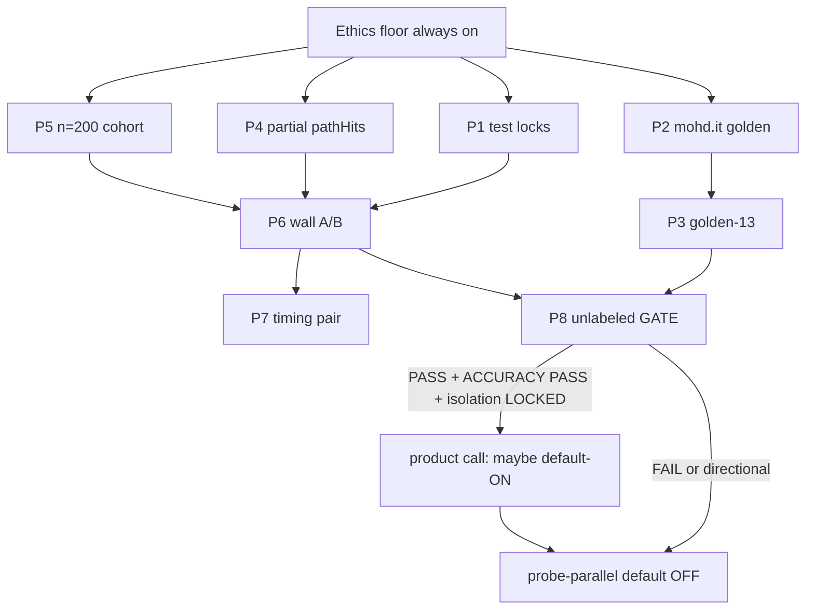

# Speed-accuracy next wave

Lab reports in this directory are the evidence packet. This file is the **execution contract** for the next wave — not a new probe algorithm, not default-ON, not a 10k claim.

**Outcome:** two measured lanes, then a fail-closed product decision.

1. **Accuracy** — `ACCURACY: PASS` on a dedicated 13-site job + isolation lock green.
2. **Speed** — unlabeled `GATE: PASS` on real n=200 (`directional: false`), wall ≥25%, 0 true→false.
3. **Default** — `--probe-parallel` stays **OFF** until (1) **and** (2). Directional 37.6% on n=61 does not unlock it.

## Scope Challenge

```
Scope Challenge:
- Existing code: Track S `--probe-parallel` opt-in (CLI/desktop default OFF);
  isolation source-lock; classify row 1 blocked≠none; directional A/B n=61.
- Requested scope: phased experiments with gates (ethics, speed n=200,
  accuracy §5 / none@ok FN=0 / isolation). Delivered in full.
- Complexity: ~12 files code + 2 live jobs; no new services.
- Selected mode: HOLD SCOPE
```

**Non-goals:** new path-probe algorithm; stop-on-hit; CF solver / personal Chrome User Data; pad `*.invalid`; bundle early-exit + lazy-settle + network-evidence into the A/B; claim 37.6% on 10k; default-ON on `GATE: PASS (directional-throughput)`; mixing golden FAIL into a speed rollback.

## Cross-plan

| Plan | Status | Relationship |
|------|--------|----------------|
| `260826-1909-cli-throughput-track-s` | completed (P5 desktop mirror blocked on unlabeled PASS) | Prior wave. Directional PASS is input, not this gate. |
| `260810-1610-local-cli-batch-scanner-accuracy-floor` | completed | Ethics floor origin. Do not reopen classify row 1. |
| `260826-0909-next-deployment-scope` | in-progress (Win smoke/tag) | Soft-related. This wave must not flip desktop `#probeParallel` checked. |
| `orchestrate-260827-apf-eval` | reports | Prior eval; lab reports supersede for 2026-08-27 numbers. |

No hard `blockedBy`. Do not edit those plan files from this wave except desktop default-ON **after** Phase 8 PASS (explicit product call).

---

## Ethics floor (inviolable — all phases)

Any violation → **STOP**. Do not continue the run, do not claim a gate, do not flip default-ON.

| Rule | Bound | Lock |
|------|-------|------|
| `blocked≠none` | `loadStatus !== 'ok'` never `verdict=none`; CSV `ket_qua` never `false` | `lib/classify.ts` row 1; `lib/export.ts` `simpleHit`; finalize `blockedToNone` |
| concurrency ≤ 3 | CLI/desktop clamp 1..3. Collect + A/B stay **2** | `cli/index.ts`; `track-s-ab.sh` |
| probe-batch ≤ 3 | CLI + in-page `Math.min(3, …)` | `lib/probe-batch.ts`; `lib/path-probe.ts` |
| no CF bypass | no solver, stealth, `page.route` challenge break, personal Chrome User Data | HITL `--scan-profile` only |
| no stop-on-hit | walk all 28 paths + junk unless **outer** 90s budget | `lib/path-probe.ts` both loops |

Hard stops (count > 0):

| Stop | Action |
|------|--------|
| true→false | Revert probe-parallel experiments. Stop speed claims. |
| blocked→none (same-row) | Ethics incident. Block ship. |
| cross-domain `finalUrl` on ok | Isolation poison. Do not credit A/B. |

`true→unknown` / `unknown→none` are **load flakes** (n=61: 99designs, designkoti, designpple, learn) — signal-only, not ethics. none→positive **with new pathHits** = allowed recall.

---

## Lane split (do not mix claims)

| Lane | Question | Artifact | Blocks default-ON? |
|------|----------|----------|--------------------|
| Throughput | Is `--probe-parallel` faster on n=200? | `plans/reports/metrics-track-s-ab.md` | Yes — needs unlabeled `GATE: PASS` |
| Live golden | Does the 13-site set match docs/07 §5? | `out/golden-13/` + `verify-golden.mjs` | Yes — `ACCURACY: PASS` |
| Unit golden | Does `classify()` match fixtures? | `test/fixtures/golden.ts` | Classify only |
| Isolation | Can two companies share a Page? | `test/cli-browser-isolation.test.ts` | Yes — must stay LOCKED |
| Ship | compile / desktop / security | this dir `ship-*.md` | No — parallel, non-blocking |

Failing golden **does not** fail a **directional** throughput claim. Passing throughput **does not** land default-ON. Isolation FAIL invalidates **both** lanes' paired numbers.

**Out dirs (never share):**

| Job | Out |
|-----|-----|
| Throughput A/B | `out/track-s-ab-{control,treatment}` only |
| Diagnostic timing | `out/track-s-ab-{control,treatment}-timing` |
| Golden 13 | `out/golden-13` |
| Cohort collect | `out/design-pilot-200` (stop after `companies.json` ≥200) |
| Forbidden | `*design-full-10k*`, `out/track-s-smoke/` (160 `*.invalid`) |

---

## GATE labels

Exactly one footer in `metrics-track-s-ab.md` from `scripts/finalize-track-s-ab.mjs`.

| Footer | When | Default-ON? |
|--------|------|-------------|
| `**GATE: PASS (directional-throughput)**` | n<200 or `directional: true`; throughput checks PASS | **No** |
| `**GATE: PASS**` | n≥200, `directional: false`, **no** DIRECTIONAL H1, throughput **and** golden §5 (or listed CF exception) | **Consider** (still needs isolation LOCKED + `ACCURACY: PASS`) |
| `**GATE: FAIL**` | any blocking check FAIL | **No** |

**Unlabeled** = footer is exactly `**GATE: PASS**` with **no** `(directional-throughput)` suffix and **no** `# DIRECTIONAL` H1.

`grep -q 'GATE: PASS'` matches **both** PASS strings. Do not use that grep to flip the checkbox.

Current file (2026-08-27): n=61, 37.6%, 0 true→false → **`GATE: PASS (directional-throughput)` only**.

---

## Evidence snapshot (2026-08-27 lab)

| Fact | Source |
|------|--------|
| n=61 directional; wall 1098s → 685s (**37.6%**); 0 true→false; 0 blocked→none; 0 cross-domain; none@ok FN PASS | `metrics-track-s-ab.md` |
| Live golden **FAIL** 3/4 affiliate-high (vecteezy blocked); 7/11 present; thorvald + pazzo **missing** from cohort | `accuracy-golden-status.md` |
| mohd.it live `partner_trade/low` on real B2B trade page — **update golden**, do not tighten `trade` | `accuracy-detector-plan.md` |
| 4 paired diffs = loadStatus flakes, not classify remaps | `accuracy-classify-audit.md` |
| Isolation **source-locked** (3/3); Playwright identity test SPEC only | `accuracy-isolation-tests.md` |
| 37.6% has **0 `timingsMs`**; 0 incomplete probes on ok; pathHits did **not** grow; mix/resume confound | `speed-timing-analysis.md` |
| Rank-1 opt: partial `pathHits` on 90s abort **before** next n=200; reject junk-overlap + stop-on-hit | `speed-probe-optimizations.md` |
| Cohort manifest still `n: 61`, `directional: true`; `out/design-pilot-200` **absent**; smoke pads forbidden | `speed-cohort-plan.md` |
| Unit 181/181; speed gate **not in suite**; `no stop-on-hit` untested | `ship-test-audit.md` |
| Desktop opt-in **LOCKED OFF**; refuse default-ON | `ship-desktop-checklist.md` |
| Compile 34 errors, ungated; CLI excluded from root tsc | `ship-compile-plan.md` |
| Linux `~/.config/google-chrome` profile GAP; shards unbounded | `ship-security-audit.md` |

---

## Dependency graph

```text
P1 test locks ─────────────────────────────────────┐
P2 mohd.it golden (code) ──► P3 golden-13 (ops) ───┤
P4 partial pathHits (code) ────────────────────────► P6 n=200 A/B ──► P7 timing ──► P8 unlabeled GATE
P5 recover n=200 (ops) ────────────────────────────┘
P9 ship (compile / Linux profile / XSS) ── parallel, never on A/B critical path
```

**Accuracy-first:** P6 must not start until P1 isolation still green **and** P4 landed (or explicitly waived with reason). P3 may run in parallel with P5 (different `out/`). P2 should land before P3 verify so mohd.it is not a matrix XX.

**Concurrency of live jobs:** ≤1 Trustpilot collect **or** ≤1 two-arm A/B at a time on this host (ethics + machine). Code phases may proceed while a collect runs.



---

## Phase 1 — Accuracy / ethics test locks

**Owner:** cook on tests only. **Deps:** none. **Effort:** 2–4h.

Isolation source-lock already exists and is green. This phase closes the holes `ship-test-audit.md` named. **Do not** start n=200 A/B if this phase is red.

### Change

| Action | File |
|--------|------|
| Modify | `test/path-probe.test.ts` — `pathHits.length === 2` after two 200s (no stop-on-hit); later-chunk hit after first 200; `pathProbe(..., 4)` ≡ batch 3; junk-first: first fetch `/zzq-`, junk=200 ⇒ exactly 1 fetch |
| Modify | `test/path-probe.test.ts` — sibling AbortError in batch=2 must not drop the other 200 (keep per-fetch `AbortController`) |
| Modify | `test/track-s-compare.test.ts` — FAIL fixture `affiliate@ok` → `none@ok` ⇒ `TRIAL: FAIL` |
| Modify | `test/cli-browser-isolation.test.ts` — keep 3 locks; do **not** add Playwright identity to default `npm test` |
| Create | `test/detector-precision-trade.test.ts` may wait for P2 |
| Modify | `test/desktop-adapter.test.ts` or small HTML read — `#probeParallel` has no `checked` so `npm test` owns GUI default |

**Do not** assert cohort `n===200` until P5 (would fail today on n=61).

### Gate P1

```bash
npx vitest run test/cli-browser-isolation.test.ts test/path-probe.test.ts \
  test/track-s-ab-guard.test.ts test/track-s-compare.test.ts \
  test/classify.test.ts test/track-s-cli-args.test.ts
npm run test:track-s
```

- [x] Isolation 3/3 PASS (`newPage` ≠ keepAlive; always `closeQuietly`; clamp ≤3)
- [x] stop-on-hit cardinality locked
- [x] sibling abort isolation locked
- [x] compare FAIL path locked
- [x] CLI/desktop probe-parallel default still false / omitted
- [x] No production code ethics-clamp change

**P1 evidence 2026-08-27:** `vitest` 6 files 53/53; `npm run test:track-s` 7 files 32/32. Tests only: `test/path-probe.test.ts`, `test/track-s-compare.test.ts`, `test/track-s-cli-args.test.ts`. Subagent tester/reviewer unavailable (balance / tool-limit); controller ran the gate commands.

**Fail →** fix tests/code; **do not** run P6.

---

## Phase 2 — mohd.it golden update (Track A)

**Owner:** accuracy lane. **Deps:** none (code). **Effort:** 2–3h.

Human-check 2026-08-27: `/en/trade-and-professionals/` is a **real B2B trade program**. Same shape as ozdesign (weak `trade`, no path hit → `partner_trade/low`). Control = treatment — **not** probe-parallel.

**Decision (locked by lab-detector):** update live golden. **Do not** tighten `WEAK_KEYWORDS` `trade`. Path-corroboration would true→false ozdesign.

### Change

| Action | File |
|--------|------|
| Modify | `test/fixtures/golden.ts` — mohd.it weak-trade fixture → `partner_trade/low`; keep namly/finnishdesignshop/thorvald/pazzo empty-hit `none/high` |
| Modify | `test/verify-golden.mjs` — `GOLDEN['mohd.it']='partner_trade'`; drop from `NONE_CASES` (length **4**) |
| Modify | `test/classify.test.ts` — none length **4**; 0 false-affiliate on remaining none; 0 blocked→none |
| Create | `test/detector-precision-trade.test.ts` — P-WW medium, P-OZ low, P-MO low, P-NONE none, P-BLOCK unknown, P-NOUP ≠ affiliate |
| Modify | `docs/07-test-plan.md` §2+§5 — mohd.it `partner_trade/low`, date 2026-08-27; “5 ca none” → **4** |
| Modify | `docs/05-detector-spec.md` §8 locale note |
| Do not touch | `lib/config.ts` weak list, `lib/classify.ts`, `cli/index.ts` probe default, `DETECTOR_VERSION` |

### Gate P2

```bash
npx vitest run test/classify.test.ts test/detector.test.ts \
  test/detector-precision-trade.test.ts test/cli-browser-isolation.test.ts
node test/verify-golden.mjs out/track-s-ab-treatment/results.json
# expect: mohd.it OK; vecteezy still XX blocked (Track B, not this phase)
```

- [x] Unit: mohd.it `partner_trade/low`; ozdesign low; williamwood medium
- [x] Unit: 4 remaining none@ok empty-hit stay `none/high`
- [x] 0 blocked→none; weak-only never affiliate
- [x] Isolation still green
- [x] probe-parallel default still OFF

**P2 evidence 2026-08-27:** vitest 50/50 on P2 files; full `npm test` 194/194. `verify-golden.mjs` treatment: mohd.it OK partner_trade/low; affiliate-high still 3/4 (vecteezy blocked — Track B). No `WEAK_KEYWORDS` / classify / probe-default edits.

**Fail →** do not rewrite mohd.it to `none` to green the matrix.

---

## Phase 3 — Dedicated 13-site golden job

**Owner:** lab-golden / ops. **Deps:** P2 preferred before verify. **Effort:** ops + optional HITL.

**Not** the n=61/n=200 A/B. Seed exact 13 from `test/verify-golden.mjs` `GOLDEN` (include thorvald + pazzo).

### Steps

1. Seed `out/golden-13/companies.json` from `docs/07` §2 / `docs/data/sample-companies.json`. Schema: `name`, `domain`, `trustScore`, `reviews`, `trustpilotUrl`.
2. Scan (accuracy, not speed):

```bash
npm run scan -- --resume --out out/golden-13 --query golden-13 \
  --scan-profile --accept-failures --concurrency 2 --virtual-display
```

- **No** `--probe-parallel` (default OFF).
- **No** `--early-exit` / stop-on-hit.
- concurrency 2. No CF bypass, no extra Chrome profile, no stealth.

3. Verify: `node test/verify-golden.mjs out/golden-13/results.json`  
   Persist **array** `results.json` (not `docs/data/test-results.json` object shape).
4. Fill `accuracy-metrics-template.md` copy → `plans/reports/orchestrate-260827-apf-lab/accuracy-metrics-golden13.md`.
5. **vecteezy (Track B HITL):** operator completes challenge **once** in the existing `--scan-profile` window, then `--resume`. If still blocked: **document exception**, keep expected `affiliate`. Do not rewrite golden to `unknown`. Do not score blocked as ranking failure.
6. finnishdesignshop blocked→`unknown` is ethics-OK (cannot prove `none`). flinders stays `unknown`.

### Gate P3 — `ACCURACY: PASS`

| Check | Target |
|-------|--------|
| Isolation | LOCKED (P1 still green) |
| 13/13 present | thorvald + pazzo in job |
| affiliate-high | **4/4** **or** listed CF exception for vecteezy (blocked, not none) + 3/3 others |
| blocked→none | 0 |
| false-affiliate | 0 on remaining none-cases (namly, finnishdesignshop if ok, thorvald, pazzo) |
| evidenceUrl | every `affiliate` row has one |
| none@ok FN | n/a on this single-arm job (paired FN is P6) |
| Ethics | conc=2, batch unused, no bypass, no stop-on-hit |

Footer (this file never prints unlabeled `GATE: PASS`):

```text
ISOLATION: LOCKED
ETHICS: PASS
GOLDEN §5: PASS | FAIL
ACCURACY: PASS | FAIL | INVALID
PROBE-PARALLEL DEFAULT: OFF
```

**Fail →** keep default OFF. Do not reopen Track S for vecteezy. Do not fold this job into P6.

---

## Phase 4 — Partial `pathHits` on abort (before n=200)

**Owner:** speed lane code. **Deps:** P1. **Effort:** 3–5h.

Largest remaining probe defect: Node `withTimeout` throw → discard **all** landed hits → sequential hits 90s more often → confound + timeout retries. n=61 had **0** incomplete ok probes, so this is fairness for n=200, not the 37.6% source.

**Not a new algo.** Same 28 paths, junk-first serial, batch 1..3, no stop-on-hit.

### Change

| Action | File |
|--------|------|
| Modify | `lib/path-probe.ts` — 5th positional `budgetMs` (inject-safe); before each **chunk**, if over deadline set `incomplete` and **do not start** chunk; return prefix hits |
| Modify | `lib/types.ts` — `incomplete?: boolean` on probe result |
| Modify | `cli/scan.ts` — pass budget; `withTimeout(..., budget+1000)` so inner return wins; `probeIncomplete = probe?.incomplete \|\| catch`; empty incomplete + no homepage → `loadStatus=timeout`; non-empty incomplete → **keep hits**, do not remap to timeout |
| Modify | tests — incomplete empty ⇒ not `none`; incomplete with hits ⇒ classify hits; junk-first unchanged |
| Do not | share one `AbortController` across a chunk; overlap junk with paths; stop-on-hit; change extension 2-arg inject behavior |

### Gate P4

```bash
npx vitest run test/path-probe.test.ts test/classify.test.ts test/cli-browser-isolation.test.ts
```

- [ ] Inner deadline returns prefix; does not start next chunk (not stop-on-hit)
- [ ] `incomplete && pathHits.length===0 && !homepage` → timeout, never `none`
- [ ] `incomplete && pathHits.length>0` → classify hits (recall); `simpleHit` still `true` if weak-only
- [ ] Per-fetch abort unchanged
- [ ] CLI/desktop `--probe-parallel` default still OFF
- [ ] Both future A/B arms get this code (shared) — **not** a treatment flag

**Fail →** do not start P6 with discard-all still in place unless explicitly waived (n=61 showed 0 aborts; waiver must be written).

**Reject:** junk-first overlap; sibling-kill in-flight; batch>3.

---

## Phase 5 — Recover real n=200 cohort

**Owner:** lab-cohort. **Deps:** none (ops). **Parallel with P2–P4.** **Effort:** collect minutes + builder patch.

Recipe: `speed-cohort-plan.md`. Do not pad.

### Steps

1. Confirm `out/design-pilot-200/companies.json` absent. **Do not** copy `out/track-s-smoke/` (160 `*.invalid`).
2. Restore 200 real companies **or** re-collect:

```bash
mkdir -p out/design-pilot-200
npm run scan -- --query design --limit 200 --max-pages 50 \
  --concurrency 2 --delay-ms 1500 \
  --out ./out/design-pilot-200 \
  --scan-profile --virtual-display --accept-failures
```

Stop when `companies.json` length ≥200 unique real domains. **This out is not an A/B arm.** No `--probe-parallel`.

3. Patch `scripts/build-track-s-cohort.mjs`:
   - Remove `lehtodesign.com`, `nordicnest.com`
   - Add `thorvalddesign.com`, `pazzodesign.it`
   - Reject `\.invalid$` / `track-s-pad-` (**exit 1**)
   - Union-insert 13 goldens; if n>200 drop **tail**, never a golden
   - if n<200 **exit 1** (no warn-and-continue)
4. `node scripts/build-track-s-cohort.mjs` → `plans/reports/track-s-benchmark-cohort-200.json`
5. Seed-check, then abort (not an A/B):

```bash
node scripts/seed-track-s-companies.mjs \
  plans/reports/track-s-benchmark-cohort-200.json \
  out/track-s-cohort-seed-check
# expect: Seeded 200; 0 .invalid
npm run scan -- --resume --out out/track-s-cohort-seed-check --concurrency 1
# expect: resume 200; 0 Trustpilot collect — then STOP
```

### Gate P5

- [ ] Manifest `n: 200`, `target: 200`, `directional: false`
- [ ] 200 unique `Company` rows; 5-field schema; **0** `*.invalid`
- [ ] `thorvalddesign.com` and `pazzodesign.it` present
- [ ] All 13 goldens present (overlap=13) — **presence ≠ §5 PASS**
- [ ] Builder pri-1 `out/design-pilot-200/companies.json` length ≥200
- [ ] Builder exits non-zero if n<200 or pads

**Fail →** stay directional. Never pad. Never unlabeled `GATE: PASS`.

---

## Phase 6 — n=200 wall-clock A/B (`--probe-parallel` only)

**Owner:** lab-ab-run. **Deps:** P1 green, P4 landed (or written waiver), P5 `directional: false`. Isolation must be re-run immediately before start.

### Preflight

```bash
npx vitest run test/cli-browser-isolation.test.ts test/track-s-ab-guard.test.ts
```

If isolation red → **do not start**. Contaminated JSONL is not a speedup.

### Run

```bash
TRACK_S_COHORT=./plans/reports/track-s-benchmark-cohort-200.json \
TRACK_S_CONTROL_OUT=./out/track-s-ab-control \
TRACK_S_TREATMENT_OUT=./out/track-s-ab-treatment \
TRACK_S_AB_REPORT=./plans/reports/metrics-track-s-ab.md \
bash scripts/track-s-ab.sh
```

| Knob | Control | Treatment |
|------|---------|-----------|
| `--probe-parallel` | **absent** | **present** |
| `--probe-batch-size` | seq (1) | default 3 (clamp 1..3) |
| `--profile-timing` | **OFF** | **OFF** |
| `--early-exit` / `--network-evidence` / `--lazy-settle` | off | off |
| `--concurrency` | **2** | **2** |
| `--scan-profile` `--accept-failures` `--resume` | yes | yes |
| `--virtual-display` | Linux both | Linux both |

Invalid A/B if: extra flag on one arm; timing mixed; shared keepAlive; `*.invalid` pads; `design-full-10k` out.

Prefer **fresh** `out/track-s-ab-*` (or timestamped `out/track-s-ab-200-*` then point env) so n=61 rows do not mix. If reusing dirs, wipe JSONL first.

If treatment `scannedAt` spans a multi-hour gap, **do not** treat wall as continuous — rerun or document `--accept-resume` (timing analysis confound on 37.6%).

### Gate P6 — speed lane

| Check | Pass |
|-------|------|
| Cohort | n=200, `directional: false`, 0 pads |
| Completeness | both arms 200/200 paired |
| Wall | treatment ≥ **25%** faster |
| true→false | **0** |
| none@ok FN | **0** (new pathHits may flip none→positive) |
| blocked→none | **0** same-row |
| cross-domain | **0** on treatment ok |

H1 must be `# Track S A/B gate` (not DIRECTIONAL) when manifest is production-sized.

Golden §5 on this export is **recorded**. Finalize will treat it as **blocking** at n≥200. Vecteezy blocked can hold unlabeled PASS — that is correct fail-closed until P3 exception or HITL.

**This phase does not flip CLI/desktop default.**

**Fail throughput / ethics / isolation → `GATE: FAIL`.** Keep opt-in. Do not invent stop-on-hit or batch>3. If isolation clean and wall <25%: keep opt-in; revisit probe only then.

---

## Phase 7 — Diagnostic timing pair (after wall)

**Owner:** lab-timing. **Deps:** P6 wall pair finished (PASS or FAIL). **Effort:** one extra pair.

**Not** mixed into the G3 wall number.

```bash
# both arms --profile-timing; new outs
# then:
node scripts/analyze-track-s-timings.mjs out/track-s-ab-control-timing/results.jsonl
node scripts/analyze-track-s-timings.mjs out/track-s-ab-treatment-timing/results.jsonl
```

Optional P1 fields only if this pair still cannot name leftover minutes: `probeIncomplete` persisted, `pathsAttempted`, junkMs/pathsMs, retryCount. Keep JSONL/ops-only (no end-user CSV).

**Do not** default-ON from a timing chart.

---

## Phase 8 — Unlabeled `GATE: PASS` and default-ON (fail-closed)

**Owner:** orchestrate + product. **Deps:** P3 `ACCURACY: PASS`, P6 speed checks, P1 isolation still green.

### Unlabeled PASS conjunction (all required)

1. Metrics footer exactly `**GATE: PASS**` (no directional suffix, no DIRECTIONAL H1).
2. Cohort `n: 200`, `directional: false`, 0 `*.invalid`.
3. Wall ≥25%, 0 true→false, 0 blocked→none, 0 cross-domain, 200/200.
4. Golden §5 PASS **or** listed CF exception:
   - vecteezy `loadStatus=blocked` (never `none`)
   - expected stays `affiliate`
   - HITL attempted + dated in golden-13 out
   - other 3/3 affiliate-high PASS
   - 0 blocked→none, 0 false-affiliate on remaining none
5. Isolation tests still green.
6. `ACCURACY:` footer PASS on golden-13 report.

If finalize cannot emit unlabeled PASS because golden is blocking and vecteezy is still XX: **keep default OFF**. Optional follow-up: teach `verify-golden.mjs` / finalize a **documented CF exception** row — accuracy-lane change, not a probe revert.

### Default-ON (only after unlabeled PASS)

| Surface | Until PASS | After PASS |
|---------|------------|------------|
| CLI `--probe-parallel` | `false` | **Product call** — may stay opt-in |
| Desktop `#probeParallel` | unchecked | **May stay opt-in** even if CLI defaults ON (`ship-desktop-checklist.md` §7.6) |
| Customer copy | no 37.6% / ≥25% SLA | still no SLA on the checkbox |
| 10k / marketing | forbidden | still not this wave |

**Forbidden until unlabeled PASS:** `checked` on `#probeParallel`; `probeParallel: true` default in `cli/index.ts` / `main.ts` / `buildScanArgv`; persist checkbox ON in `localStorage`.

`desktop-validate.sh` must keep failing if `#probeParallel` is `checked`.

---

## Phase 9 — Ship lane (parallel, non-blocking)

Never on the A/B critical path. Never flips probe-parallel.

| Track | From | Next | Gate |
|-------|------|------|------|
| Compile | 34 tsc errors, CI ungated | `ship-compile-plan.md`: `allowImportingTsExtensions` → 17 holes → `tsconfig.cli.json` → CI **after** local exit 0 | `npm run compile` exit 0 **before** adding CI step |
| Security | Linux personal Chrome ALLOW; shards unbounded; options href XSS | reject `~/.config/google-chrome`; cap shards; DOM links http(s) | no CF bypass “fix” |
| Desktop | opt-in locked | stay unchecked; P2 VN copy nits optional | `npm run desktop:validate` |
| Tests | 181/181 | P1 locks; do not add n=200 assert before P5 | suites green **and** locks exist |

Compile **must not** loosen `ClassifyInput` / `Verdict` to make tsc happy.

---

## Kill / rollback matrix

| Signal | Response |
|--------|----------|
| true→false > 0 | Revert `--probe-parallel` experiments; stop speed claims |
| blocked→none > 0 | Ethics incident; block ship |
| cross-domain > 0 | Isolation poison; discard A/B; fix `openPage` |
| Isolation test FAIL | `ACCURACY: INVALID`; do not interpret diffs |
| Golden affiliate-high < 4/4 without CF exception | No default-ON |
| n<200 or pads | DIRECTIONAL only; never unlabeled PASS |
| CF solver / personal profile / conc>3 / batch>3 / stop-on-hit | Reject the change |
| Mixing early-exit + parallel + dcl in one A/B | Invalid measurement |

Rollback P4: feature is inner deadline in shared `pathProbe`; revert file if incomplete→`none` appears.

Rollback P2: revert fixtures + docs dates; do **not** “fix” by forcing `none`.

---

## Files (wave-owned)

**Create**

- `plans/reports/orchestrate-260827-apf-lab/accuracy-metrics-golden13.md` (P3 fill)
- `test/detector-precision-trade.test.ts` (P2)
- `out/golden-13/` (ops, gitignored)
- `out/design-pilot-200/companies.json` (ops, gitignored)
- optional `tsconfig.cli.json` (P9)

**Modify**

- `test/path-probe.test.ts`, `test/track-s-compare.test.ts`, `test/cli-browser-isolation.test.ts` (P1)
- `test/fixtures/golden.ts`, `test/verify-golden.mjs`, `test/classify.test.ts`, `docs/07-test-plan.md`, `docs/05-detector-spec.md` (P2)
- `lib/path-probe.ts`, `lib/types.ts`, `cli/scan.ts` (P4)
- `scripts/build-track-s-cohort.mjs`, `plans/reports/track-s-benchmark-cohort-200.json` (P5)
- `plans/reports/metrics-track-s-ab.md` (P6 finalize overwrite)

**Do not touch for this wave**

- `lib/classify.ts` row 1
- `lib/config.ts` `WEAK_KEYWORDS` / `PROBE_PATHS` (P2 non-goal)
- live `design-full-10k`
- desktop `#probeParallel` `checked`
- `cli/index.ts` `probeParallel: false` default (until Phase 8 product call)

---

## Anti-patterns

- Default-ON probe-parallel on directional n=61
- Pad cohort with `*.invalid` or random hosts
- Claim 37.6% (or 320/h) on 10k / customer SLA
- Fail speed land solely because live golden FAIL **while directional**
- Fail accuracy land because wall <25%
- Bundle `--early-exit` / `--network-evidence` / DCL into Track S A/B
- Point `--profile` at personal Chrome User Data / `~/.config/google-chrome`
- Concurrency >3, probe-batch >3, stop-on-hit, CF bypass
- New probe algorithm because 37.6% “proves we need more”
- `grep GATE: PASS` to authorize default-ON (matches directional)
- Scoring blocked rows as throughput failure
- Folding 13-site golden into `out/track-s-ab-*`

---

## Success criteria (wave)

- [ ] Ethics floor held on every live job (0 blocked→none; conc=2; batch≤3; no bypass; no stop-on-hit)
- [ ] Isolation regression still LOCKED
- [ ] P2: mohd.it live+unit `partner_trade/low`; 4 remaining none@ok FN=0 at unit
- [ ] P3: `ACCURACY: PASS` on golden-13 (4/4 or listed CF exception)
- [ ] P5: cohort n=200 `directional: false`, 0 pads, 13 goldens present
- [ ] P6: wall ≥25%, 0 true→false, 0 none@ok FN, 200/200
- [ ] Metrics unlabeled `GATE: PASS` **or** explicit documented blocker (vecteezy CF / wall miss) — never a silent directional PASS
- [ ] `--probe-parallel` CLI+desktop **OFF** unless Phase 8 conjunction all true **and** product call
- [ ] `npm test` + `npm run test:track-s` green after code phases

---

## Unresolved questions

1. After unlabeled PASS, does **desktop** stay opt-in while CLI defaults ON? Lab default: **desktop stays unchecked**.
2. vecteezy still blocked after HITL: document CF exception in finalize **vs** hold default-ON until 4/4 live? Lab default: exception allowed **only** if blocked≠none and HITL dated.
3. Stakeholder OK shrinking docs/07 none-set 5→4 (mohd.it → partner_trade)? Lab-detector: **yes**.
4. Playwright concurrent-`openPage` identity test: ship job vs leave SPEC? Default: **not** in `npm test` this wave.
5. Can `out/design-pilot-200/companies.json` be restored from another disk, or must collect re-run?

---

## Next (cook order)

1. P1 test locks (unblocks P6).
2. P2 golden update (unblocks honest P3).
3. Parallel: P4 code + P5 collect + P9 compile (file-disjoint).
4. P3 golden-13 (ops) overlapping P5 if machine-idle allows only one headed Chrome — **serialize live Chrome**.
5. P6 A/B only after P1+P4+P5 gates.
6. P7 timing optional.
7. P8 product call — default stays OFF until unlabeled `GATE: PASS`.

Handoff cook path (this file, not a timestamped `plans/<slug>/plan.md`):

`/ak:cook /home/manhquy/Downloads/affiliate-partner-finder/plans/reports/orchestrate-260827-apf-lab/orchestrate-plan.md`
