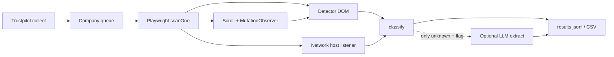

# Research Report: AI crawl tools → nâng cấp chất lượng APF

**Timestamp:** 2026-08-13 08:02 +07  
**Skills:** `/ak-brainstorm` + `/ak-research`  
**Repo:** affiliate-partner-finder (TS / Playwright / detector+path-probe / desktop ETA)

## Brainstorm contract

| Field | Content |
|-------|---------|
| **Outcome** | Shortlist công nghệ/GitHub tool có thể **cải thiện độ đúng + tốc độ + unknown↓** cho scan affiliate/partner; chỉ rõ cái nào `ak:xia` mang về được. |
| **Constraints** | Stack TS+Playwright; ethics clamp concurrency≤3; **không bypass CAPTCHA**; CF = HITL; giữ CLI+desktop+extension chung detector; YAGNI/KISS; chi phí LLM batch 10k phải kiểm soát. |
| **Non-goals** | Thay cả engine bằng Crawl4AI/Browser-Use Python; phụ thuộc Firecrawl cloud làm core; agent NL cho mọi URL; tăng concurrency vượt clamp. |
| **Acceptance** | Báo cáo này: bảng xếp hạng + verdict Xia + 1–2 hướng port cụ thể + rủi ro. Không implement trong bước này. |

## Executive Summary

Các tool AI crawl “hot” trên GitHub (**browser-use ~109k★**, **Crawl4AI ~78k★**, **Firecrawl**, **Webwright**, **HyperAgent**) tối ưu cho **RAG markdown / agent tương tác**, không phải **deterministic affiliate verdict + evidence** như APF.

**Không nên xia nguyên repo.** Nên **xia micro-pattern** từ tool gần domain hơn:

1. **Network-layer affiliate host matching** (ý TagScope + ShopBack-style redirect/host tables) — giảm `unknown` / bắt Impact/Awin khi DOM không lộ link.
2. **MutationObserver / lazy-injected links** (injected-links) — bắt widget affiliate load sau scroll.
3. **Optional LLM extract chỉ khi `unknown` + confidence thấp** (ý HyperAgent `page.extract`) — không chạy LLM trên 10k URL.

Giữ Playwright deterministic làm xương sống; AI chỉ lớp phụ.

## Research Methodology

- Sources consulted: 5 web searches + local scout (`lib/detector.ts`, `path-probe.ts`, `run-engine.ts`, README ethics).
- Date range: materials 2025–2026 (stars/benchmarks as of ~2026-08).
- Key terms: AI crawler Playwright, Crawl4AI, browser-use, Firecrawl, affiliate network detector, TagScope, network intercept.

## Key Findings

### 1. Landscape (2026)

| Tool | Stars (approx) | Stack | Job-to-be-done | Fit APF |
|------|----------------|-------|----------------|---------|
| browser-use | ~109k | Python → CDP | NL agent multi-step | **Poor** for batch 10k (cost/latency); wrong language |
| Crawl4AI | ~78k | Python+PW | LLM-ready markdown / adaptive crawl | **Poor** as transplant; **ideas** OK (adaptive stop, stealth flags) |
| Firecrawl | large OSS+API | API/Python/JS | scrape→markdown/JSON service | **Avoid as core** (vendor/cost); optional side tool only |
| microsoft/Webwright | ~6k | Python+PW | SWE-style agent scripts | **Poor** — research agent, not product scan |
| HyperAgent | ~1.5k | TS+PW+AI | `page.ai()` / `page.extract()` | **Medium** — pattern for unknown fallback |
| TagScope | niche | Python+PW | martech/tag network auditor | **High idea fit** — network signatures |
| affiliate-network-detector | niche/Apify | proprietary actor | ShopBack click-out → network host | **Idea fit**; source not freely portable |
| injected-links | tiny | Python+PW | MutationObserver lazy links | **High pattern fit**, tiny surface |
| Crawlee PW utils | mature | **TypeScript** | block assets, enqueue, gotoExtended | **Medium** — throughput helpers, same stack |

### 2. Current APF evidence (local)

- Layer 1: in-page **DOM detector** (anchors + platform host rules) — injected, self-contained.
- Layer 3: **path-probe** same-origin paths with soft-404 junk baseline.
- Ops: profile cookies, virtual-display, shard concurrency≤3, early-exit, desktop rolling ETA.
- Gap: no systematic **request/response host graph**; weak on JS-injected / network-only affiliate pixels; `unknown` still large on 10k runs.

### 3. Best practices relevant to APF

1. **Deterministic first, LLM last** — batch economics + reproducibility for CSV HITL.
2. **Observe network without rewrite** (`page.on('request'|'response')`) — cheaper than `route()` cache kill (Crawlee docs warn).
3. **Evidence-preserving signals** — host match + redirect chain + DOM link; keep `evidenceUrl`/`method`.
4. **Adaptive stop** — already partially via `--early-exit`; extend with “enough signal” not full path list.
5. **Never automate CF/CAPTCHA** — project policy; crawl4ai “undetected” is out of ethics scope for this product.

### 4. Security / ethics

- Stealth/undetected browser stacks **conflict** with “no CAPTCHA bypass / HITL CF”.
- LLM agents that “solve challenges” = reject.
- Porting untrusted repo code via Xia: treat as data only; challenge phase required.

### 5. Performance

- Observed APF ~150–200 companies/h @ 3×3 workers ≈ ~3 min/site wall — bottleneck is **browser site scan**, not Trustpilot collect.
- LLM-per-page (browser-use/Crawl4AI extract) would **worsen** ETA unless gated to unknown subset (~30% of rows → still expensive).
- Asset blocking (Crawlee `blockRequests`) can cut load time **if** it doesn’t break SPA affiliate widgets — A/B carefully.

## Comparative Analysis — Xia readiness

| Candidate | Xia mode | Port what? | Verdict |
|-----------|----------|------------|---------|
| TagScope pattern | `--port` ideas | Network host/tag signature table + listen requests during scan | **YES — priority 1** |
| injected-links | `--port` | MutationObserver + scroll settle before detector | **YES — priority 2** |
| HyperAgent extract | `--compare` then thin `--port` | Optional `unknown` → structured LLM schema | **MAYBE — priority 3** (flag off by default) |
| Crawlee playwrightUtils | `--port` selective | `blockRequests` for images/fonts; not full Crawlee | **MAYBE — priority 4** |
| Crawl4AI | **no** full port | Steal adaptive crawl / session concepts only | **IDEAS only** |
| browser-use / Webwright | **no** | Wrong product shape + Python + cost | **NO** |
| Firecrawl | **no** core | External API for ad-hoc research | **NO as dependency** |
| ShopBack detector | **no** source | Document redirect-host method; reimplement hosts table | **IDEAS only** |

### Recommended Xia targets (concrete)

```text
/ak:xia JerushaGray/TagScope "network request host signature matching for affiliate/martech" --compare
# then if accepted:
/ak:xia JerushaGray/TagScope "request listener + host pattern table" --port --auto

/ak:xia aviel-fahl/injected-links "MutationObserver lazy link capture + scroll" --port
```

HyperAgent only after unknown-rate baseline measured:

```text
/ak:xia hyperbrowserai/HyperAgent "page.extract structured schema fallback" --compare
```

## Implementation Recommendations

### Chosen direction (smallest that raises quality)

**A. Network evidence layer (new)** during `scanOne`: collect third-party hosts matching expanded platform/affiliate CDN table; merge into classify with method=`network`.

**B. Post-load settle:** short scroll + MutationObserver window before `runDetector`.

**C. Hold LLM** until A+B measured on golden set; then optional `--llm-unknown` for subset.

### Quick start (next delivery — not this report)

1. Baseline: % verdicts on golden + sample of design-full-10k unknown.
2. Plan: `network-hit` types + config table (no new Python runtime).
3. Cook A then B; ship behind flag if needed.
4. Only then Xia HyperAgent compare for LLM fallback.

### Common pitfalls

- Transplanting Crawl4AI/browser-use → dual runtime, slower 10k, ethics drift.
- `page.route('**/*')` for “stealth” → breaks cache, slows scan.
- LLM on every page → cost blow-up, non-reproducible CSV.
- Claiming stars = fit — stars measure agent hype, not affiliate precision.

## Diagram — delivery flow (chosen direction)



## Resources & References

- https://github.com/unclecode/crawl4AI
- https://github.com/browser-use/browser-use
- https://github.com/microsoft/Webwright
- https://github.com/hyperbrowserai/hyperagent
- https://github.com/JerushaGray/TagScope
- https://github.com/aviel-fahl/injected-links
- https://github.com/trivikrama-madhusudhana/affiliate-network-detector
- https://dataresearchtools.com/firecrawl-vs-crawl4ai-vs-browseruse-2026/
- https://playwright.dev/docs/network
- https://crawlee.dev/js/api/playwright-crawler/namespace/playwrightUtils
- Local: `lib/detector.ts`, `lib/path-probe.ts`, `docs/README.md` (why not server crawler)

## Appendices

### A. Glossary

- **Xia:** AgentKit skill to extract/compare/port a feature from another repo into this stack.
- **HITL CF:** human completes Cloudflare once in shared Chrome profile.
- **Unknown:** classify verdict when evidence insufficient.

### B. Unresolved questions

1. Golden-set size đủ để đo lift của network-layer trước khi LLM?
2. Có chấp nhận dependency LLM API (OpenAI/local) trong desktop product không?
3. Asset blocking có phá path-probe / SPA affiliate pages trên sample thật?

### C. Handoff

- Next: `/ak:plan` cho **network evidence + lazy settle** (không full AI crawler).
- Or: `/ak:xia JerushaGray/TagScope … --compare` ngay nếu muốn evidence map trước plan.
