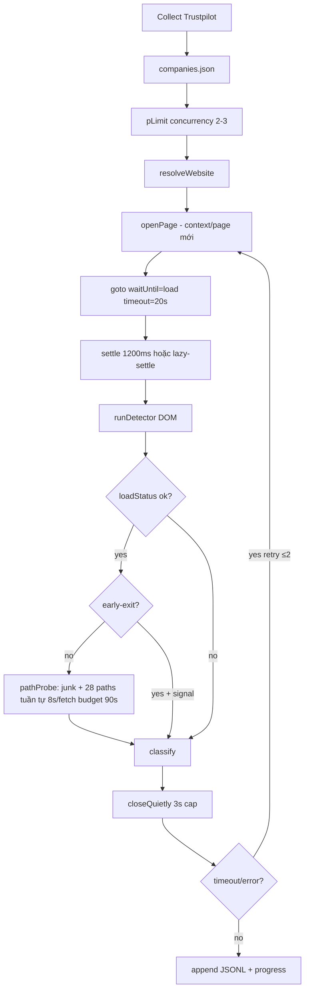

# Research Report: Tối ưu tốc độ Affiliate Partner Finder

**Timestamp:** 2026-08-26 17:00 +07  
**Phạm vi:** CLI batch + Desktop (Playwright) + Extension MV3  
**Nguồn:** codebase, pilot 200, baseline 10k shard, Playwright scraping best practices (2024–2025)

---

## Executive Summary

Tốc độ chậm **không phải một bug đơn lẻ** mà là tích lũy của (1) kiến trúc quét 3 lớp có **path-probe tuần tự** lên tới 28 URL/site, (2) **ngân sách thời gian bảo thủ** (goto `load` 20s, settle 1.2s, wall 120s/company), (3) **concurrency bị khóa ≤3** vì ethics, và (4) **~31% unknown** chủ yếu là access failure (blocked/timeout) — tốn wall-clock mà không tạo kết quả CSV hữu ích.

Pilot 200 công ty: **~4h @ concurrency 2 ≈ 1–2 company/phút**. Extrapolate 10k: **~5+ ngày** scan-only. Shard live ghi nhận **~21–25/h** (cooling) vs **~108/h** span avg — throughput thực tế còn thấp hơn lý thuyết khi job dài.

**Khuyến nghị chiến lược:** Tách **Track S (Speed/throughput)** khỏi **Track A (recall trên trang ok)** và **Track B (access/blocked/timeout)**. Ưu tiên đo **phân rã latency theo phase** trước khi tối ưu mù; sau đó triển khai các thay đổi **flag-gated** với A/B trên cohort 200 cố định.

---

## Brainstorm Contract

| Field | Nội dung |
|-------|----------|
| **Outcome** | Lộ trình nghiên cứu + thử nghiệm có thể đo được để tăng throughput (companies/h) mà không phá ethics (`blocked≠none`, no CF bypass, concurrency≤3). |
| **Constraints** | Không rewrite detector core; không stealth/bypass; concurrency≤3; quality flags default OFF trên job lớn; Track A không claim `unknown%↓`. |
| **Non-goals** | Crawl4AI port; LLM classify; concurrency>3; giảm unknown bằng cách ghi false; extension parity ngay. |
| **Acceptance** | (1) Báo cáo phân rã bottleneck có số liệu; (2) ≥3 hướng tối ưu có trade-off + gate A/B; (3) plan slug riêng cho implementation sau khi user chọn. |

---

## 1. Cách tool hoạt động (pipeline thực tế)

### 1.1 Luồng CLI / Desktop

**File then chốt:** `cli/index.ts`, `cli/scan.ts`, `cli/browser.ts`, `lib/path-probe.ts`, `lib/config.ts`.

### 1.2 Extension MV3 (chậm hơn CLI by design)

- **1 tab serial** (`lib/run-engine.ts`), delay mặc định **2s** giữa các company.
- Settle **700ms** (nhẹ hơn CLI 1200ms) nhưng **không concurrency**.
- Path-probe cùng logic, không có network-evidence/lazy-settle CLI flags.

### 1.3 Tham số timing hiện tại

| Tham số | Giá trị | Vị trí |
|---------|---------|--------|
| `tabTimeoutMs` (goto) | 20_000 ms | `lib/config.ts` |
| Settle cố định | 1_200 ms | `cli/browser.ts` DEFAULT_SETTLE_MS |
| Scan wall / company | 120_000 ms | `cli/scan.ts` DEFAULT_SCAN_BUDGET_MS |
| Path fetch / request | 8_000 ms | `lib/path-probe.ts` |
| Số path probe | **28** | `lib/config.ts` PROBE_PATHS |
| Path-probe budget | min(28×8s+8s, 90s) ≈ **90s** | `cli/scan.ts` |
| Concurrency | 2 (turbo 3) | ethics cap |
| Retry | ≤2 + delay 1.5s | `scanWithRetry` |
| Close cap | 3s | `closeQuietly` |

**Worst-case lý thuyết / company (ok, không early-exit):** goto 20s + settle 1.2s + probe 90s ≈ **111s** trước retry. Retry có thể nhân đôi.

---

## 2. Chẩn đoán bottleneck (evidence-backed)

### 2.1 Phân rã kết quả (baseline ~3659 rows)

| Slice | n | % | Ý nghĩa throughput |
|-------|--:|--:|-------------------|
| unknown | 1145 | 31.3% | **Wall-clock lãng phí** — không ra true/false |
| └ blocked | 588 | 51% unknown | Bot/CF — goto + retry |
| └ timeout | 530 | 46% unknown | goto 20s hoặc probe treo |
| ok | ~72% pilot | — | Vẫn phải chạy full probe nếu không early-exit |

**Kết luận:** ~1/3 thời gian job có thể đang “đốt” vào access failure — đây là **Track B**, không fix bằng network-evidence/lazy-settle.

### 2.2 Path-probe tuần tự — bottleneck CPU/network lớn nhất trên trang ok

`pathProbe()` loop **tuần tự** 28 fetch, mỗi fetch abort 8s. Trên site chậm hoặc CDN lag, **hàng chục giây / company** dù homepage không có signal.

Pilot ghi nhận: `lehtodesign.com` treo worker cho đến kill/resume.

### 2.3 `waitUntil: 'load'` vs nhu cầu detector

CLI dùng `page.goto(..., { waitUntil: 'load' })`. Detector chỉ cần DOM + link (`runDetector` query `a`). Industry best practice: **`domcontentloaded`** thường đủ, nhanh hơn đáng kể trên site nặng asset.

Trade-off: SPA lazy-render có thể cần settle/lazy-settle — đã có flag `--lazy-settle`.

### 4. Không block resource

Extension/CLI **cố ý không abort asset** (parity observation). Mọi image/font/CSS vẫn tải → goto `load` chậm hơn.

### 2.5 Context lifecycle

Chế độ ephemeral (`--scan-profile` OFF): **browser.newContext() + newPage() mỗi company** → overhead tạo context + memory churn. Chế độ profile: shared context, page mới — tốt hơn cho CF, vẫn newPage/close mỗi lần.

### 2.6 Resume semantics

`timeout`/`error` **non-terminal** → resume requeue → job “không bao giờ xong” nếu nhiều site chết. Đúng về chất lượng, **tệ về throughput** (pilot: 28 pending requeue).

---

## 3. Ba hướng tiếp cận (trade-offs)

### Hướng A — **Throughput-first trong ethics cap** (khuyến nghị làm trước)

**Giả định load-bearing:** Phần lớn thời gian trên `ok` sites là path-probe + goto `load`, không phải detector.

| Thay đổi | Lợi | Rủi | Gate |
|----------|-----|-----|------|
| `--fast-nav` goto `domcontentloaded` + timeout tiered | −20–40% goto time ước tính | Miss SPA signal | A/B 200 cohort: none FP=0 |
| Path-probe **parallel batch** (concurrency 4–6 in-page) + strong-first | −50–70% probe time median | Server load / rate limit | golden + none@ok sample |
| **Probe tier**: fast mode 8 paths strong trước, full 28 nếu inconclusive | Early cut trên clear none | Miss path-only program | FN trên labeled set |
| Bật `--early-exit` mặc định khi có strong link/platform | Bỏ probe ~30–50% ok+signal | Miss path-only khi homepage trống | Track A metrics only |
| Per-phase timing trong JSONL | Đo chính xác trước/sau | Schema nhỏ | N/A |

**Fails first when:** Site chỉ có program ở deep path không nằm trong tier-1 + homepage trống → cần `--thorough` flag giữ hành vi cũ.

### Hướng B — **Access / fail-fast** (Track B code — plan slug riêng)

**Giả định:** 31% unknown là trần throughput; giảm retry vô ích quan trọng hơn tăng concurrency.

| Thay đổi | Lợi | Rủi | Gate |
|----------|-----|-----|------|
| Adaptive goto budget: 12s fast / 25s slow class | Ít worker bị kẹt 120s | False timeout trên site chậm thật | access-unknown% trên window ≥500 |
| Block detector sớm → skip probe | Fail nhanh blocked | — | blocked→none=0 |
| `--accept-failures` default OFF nhưng UX desktop “chấp nhận lỗi cũ” | Job finito nhanh | Bỏ retry quality | Operator choice |
| `--scan-profile` khuyến nghị mạnh hơn | ↓ blocked | Profile lock / memory | blocked rate A/B |

**Fails first when:** CF arms race — không bypass được bằng timeout tuning alone.

### Hướng C — **Infrastructure scaling** (không đụng detector)

| Thay đổi | Lợi | Rủi |
|----------|-----|-----|
| Worker pool N contexts cố định thay vì newContext/company | ↓ overhead | Phức tạp session isolation |
| Browser restart mỗi 200–500 pages | ↓ memory leak stall | Brief downtime |
| Shard tuning (đã có) | Parallel jobs | Ethics per shard |

**Cheapest to abandon:** Hướng C nếu profiling cho thấy overhead context <10%.

---

## 4. Khung đo lường (bắt buộc trước implementation)

### 4.1 Metrics

| Metric | Công thức | Mục tiêu nghiên cứu |
|--------|-----------|---------------------|
| Throughput | completed_scan / wall_hours | ↑ từ ~25/h → 60–80/h (realistic) |
| P50/P95 `t_total` | ms/company | P95 ↓ 30%+ |
| Phase ratio | t_goto, t_settle, t_detector, t_probe | Xác định #1 bottleneck |
| unknown rate | blocked+timeout+error / n | Track B — không dùng làm KPI Track S alone |
| Quality guard | golden FP, blocked→none, none@ok FN | Không regress |

### 4.2 Cohort cố định

- **`out/design-pilot-200/`** — đã có baseline 4h.
- Chạy lại với cùng flags + instrumentation; so sánh paired.

### 4.3 Instrumentation đề xuất (minimal)

Thêm optional `timingsMs: { goto, settle, detector, probe }` vào `ScanResult` khi `--profile-timing` — không đổi CSV end-user.

---

## 5. Best practices ngoài (Playwright scraping 2024–2025)

1. **`domcontentloaded`** thay `load` khi DOM đủ cho extract.
2. **Worker pool** contexts cố định, không burst unbounded `Promise.all`.
3. **Fail-fast timeouts** per action — tránh global 120s che giấu site chết.
4. **Resource blocking** (image/font/css) — throughput ↑ mạnh; **cần A/B recall** vì lazy widgets.
5. **Tránh `waitForTimeout` mù** — lazy-settle đã thay bằng MO budget (Track A).
6. **Restart browser** định kỳ trên job dài — giảm stall do memory.

---

## 6. Implementation Recommendations (thứ tự)

1. **Spike 0.5d:** `--profile-timing` + báo cáo P50/P95 trên 50 company sample.
2. **Spike 1d:** Prototype parallel path-probe (batch 5) behind `--probe-parallel`.
3. **A/B 1d:** `domcontentloaded` + settle 800ms vs baseline trên pilot-200.
4. **Decision gate:** Nếu throughput ↑ ≥25% và golden pass → plan slug `2608xx-scan-throughput-track-s`.
5. **Track B song song:** Chỉ mở slug timeout/goto khi ops runbook không cải thiện unknown/h.

---

## 7. Quick wins (không cần code)

| Hành động | Tác dụng |
|-----------|----------|
| Bật **Tăng tốc** (concurrency 3) | +~50% theoretical |
| Bật **`--scan-profile`** sau CF pass | ↓ blocked |
| Bật **`--early-exit`** khi chấp nhận miss path-only | ↓ probe time |
| **`--accept-failures`** khi muốn job kết thúc | Tránh requeue vô hạn |
| Tắt quality flags trên 10k | Đúng default — giữ throughput |

---

## 8. Unresolved Questions

1. User ưu tiên **tốc độ tuyệt đối** hay **hoàn thành 10k với unknown thấp**?
2. Có chấp nhận **fast scan profile** (ít path, early-exit on) cho job hàng ngày, **thorough** cho spot-check?
3. Extension có cần parity throughput hay chỉ desktop/CLI?

---

## Resources

- Internal: `plans/reports/live-verify-260810-design-pilot-200.md`, `ops-260813-track-b-access-runbook.md`, `plans/260813-0816-network-lazy-settle-quality-track-a/plan.md`
- External: [Playwright scraping performance (ScrapingBee)](https://www.scrapingbee.com/blog/playwright-web-scraping/), [Worker pools](https://web-automations.com/web-scraping-and-data-extraction/scraper-performance-and-scaling/running-parallel-scrapers-with-worker-pools/)
